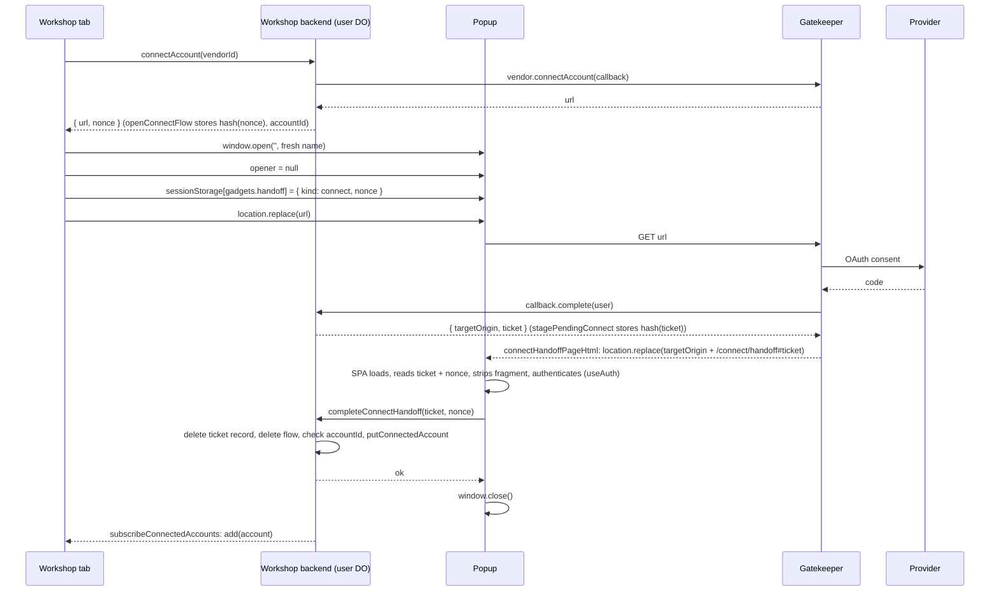
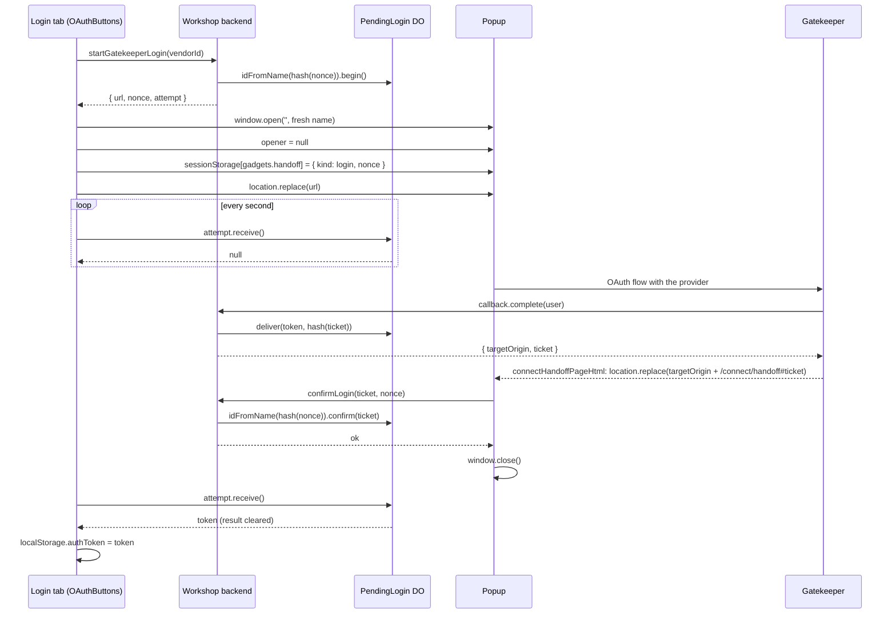

# The connect handoff

How a finished gatekeeper connect, reconnect, ensure-resources or sign-in flow is bound to the
browser that started it. The pieces: the **ticket** (`ConnectHandoff` in
`packages/workshop-shared/src/gatekeeper.ts`), the **nonce** (`ConnectFlowStart` in
`packages/workshop-shared/src/api.ts`), the gatekeeper's completion page (`connectHandoffPageHtml` in
`packages/gatekeeper-kit/src/connect-pages.ts`), the Workshop's `/connect/handoff` page
(`packages/workshop-frontend/src/ConnectHandoffPage.tsx`) and the server side
(`packages/workshop-backend/src/connect-handoff.ts`, `user.ts`, `auth/login-flow.ts`).

## The threat, and the ticket

A connect / reconnect / sign-in URL is a bearer capability: whoever opens it can finish the flow,
and nothing in the HTTP requests ties the browser that finishes to the user who started it. An
attacker can therefore start a connect in their own Workshop account and phish a victim into
opening the URL, whereupon the victim's provider credentials would land in the attacker's account
(or, for sign-in, the attacker would receive a session as the victim).

The defence is that finishing the flow activates nothing. `GatekeeperConnectCallback.complete()` /
`reconnectComplete()` return a `ConnectHandoff = { targetOrigin, ticket }`:

- `ticket` is a fresh 256-bit secret (`newSecretToken()`), rendered as 64 lowercase hex characters.
  Only its SHA-256 hash is stored, and only in the initiating user's Durable Object
  (`pendingHandoffs` in `user.ts`, written by `#stagePendingHandoff`) or, for sign-in, in the
  `PendingLogin` DO (`deliver()` in `login-flow.ts`). It is single-use and valid for
  `PENDING_HANDOFF_LIFETIME_MS` (two minutes).
- `targetOrigin` is the Workshop's origin, from deployment configuration only:
  `handoffTargetOrigin(env)` reads `PUBLIC_BASE_URL` and fails closed when it is unset. No request
  header is consulted, so nothing a client asserts can route the ticket elsewhere.

Until the ticket is redeemed the gatekeeper holds credentials that are reachable from no Workshop
account: a connect is staged (`stagePendingConnect`), a reconnect's credentials stay staged in the
gatekeeper under a `stageId` (`stagePendingRestore`), a sign-in's token is parked in `PendingLogin`.
A connect is redeemed over the initiating user's own authenticated session
(`AuthenticatedApi.completeConnectHandoff`, which looks the ticket up in the caller's own DO), and
only that redemption activates the grant. A victim who finishes an attacker's flow ends with a
ticket their own session cannot redeem.

## The nonce

The ticket alone binds redemption to the _user_; the nonce binds it to the _popup the Workshop
opened for that flow_. Every flow start (`connectAccount`, `reconnectAccount`,
`ensureAccountResources`, `startGatekeeperLogin`) mints a second `newSecretToken()` server-side and
returns its hex alongside the `url`. The Workshop tab writes it into the **popup's** sessionStorage,
never its own: `openDisownedPopup` in `connectHandoff.ts` opens the popup empty
(`window.open('', name, features)` yields a same-origin `about:blank`, so `popup.sessionStorage` is
writable), sets `opener = null`, stores `{ kind, nonce }` under `HANDOFF_KEY` (`gadgets.handoff`),
and only then navigates the popup with `location.replace(url)`.

Why the popup's storage:

- The nonce then exists in exactly two places, the server and that popup. A handoff link opened any
  other way — a fresh tab, a pasted URL, a `target=_blank` link from the Workshop, a link an
  attacker sends the victim — holds no nonce and redeems nothing. Without it, a public
  `confirmLogin(ticket)` would let anyone holding a ticket push a login into the victim's tab with
  no click at all, and a public redemption endpoint would be a one-click oracle for whether a
  ticket is live.
- sessionStorage is scoped per top-level browsing context and per origin. It survives the popup's
  trip through the gatekeeper and the provider (those documents, on other origins, see a different
  storage) and is readable again once the popup is back on the Workshop origin.
- Every popup gets a fresh window name (`uniquePopupName('gadgets-connect')` /
  `uniquePopupName('gatekeeper-login')`): `window.open('', existingName)` returns an existing window
  _without navigating it_, and a popup still parked on a provider page is cross-origin, so the
  storage write would throw. The name carries a random suffix (`crypto.randomUUID()`) rather than a
  per-document counter: a reload resets a counter while an old disowned popup keeps its name.
  `openConnectWindow` closes the previous connect popup this tab holds, best-effort, before opening
  the next.

Server side, for connects: `openConnectFlow(accountId)` in `user.ts` records
`{ nonceHash, accountId, expiresAt }` in `pendingConnectFlows`, alive for `CONNECT_FLOW_LIFETIME_MS`
(30 minutes, sized for the gatekeeper's initiation nonce plus the OAuth nonce plus the handoff
window). `completeConnectHandoff(ticket, nonce)` hashes both (`hashPresentedSecret`; anything but
64 lowercase hex hashes to nothing), then, in this order: reads and deletes the ticket's
`pendingHandoffs` record; reads and deletes the nonce's `pendingConnectFlows` record; checks that
both exist, neither has expired, and `flow.accountId === record.accountId`. The deletes happen
before the checks, under the DO's input gate, so a ticket is spent however the rest goes, a wrong
nonce still spends the ticket, and a nonce cannot be retried against another ticket. A staged connect
the checks reject is dropped like an unredeemed one (`#dropPendingConnect`, which revokes the grant).

For sign-in the nonce _addresses_ the state: `startGatekeeperLogin` names the `PendingLogin` DO
`idFromName(hash of nonce)`, so `confirmLogin(ticket, nonce)` can find the attempt while the login
tab holds only the `attempt` capability and no id at all.

## Account connect

1. The tab calls `AuthenticatedApi.connectAccount(vendorId)` (or `reconnectAccount` /
   `ensureAccountResources`). The user DO asks the vendor for the flow `url`, mints the nonce with
   `openConnectFlow`, and returns `{ url, nonce }`.
2. `openConnectWindow(flow)` opens the disowned popup carrying the nonce and navigates it to `url`.
3. The popup traverses the gatekeeper and the provider. On success the gatekeeper calls
   `callback.complete(user)`; `GatekeeperConnectCallbackImpl` (in `user.ts`) forwards to
   `stagePendingConnect`, which stores the ticket's hash and returns `{ targetOrigin, ticket }`.
4. The gatekeeper renders `connectHandoffPageHtml(handoff)`, whose script does
   `window.location.replace(targetOrigin + "/connect/handoff#" + encodeURIComponent(ticket))`. The
   kit validates that `targetOrigin` is exactly an origin and knows nothing else about the handoff;
   this is the only document in the flow without an RPC client.
5. `/connect/handoff` is the Workshop SPA: route `src/routes/connect.handoff.tsx`, component
   `ConnectHandoffPage`, rendered standalone and header-less by `src/routes/__root.tsx`
   (`isHandoff`). The page reads the ticket from the fragment (`ticketFromHandoffFragment`) and the
   nonce from its own sessionStorage (`readPopupHandoff`, which removes the record as it reads),
   strips the fragment with `history.replaceState`, authenticates its own WebSocket RPC session the
   way any Workshop tab does (its own `useAuth`: the shared `localStorage` `authToken`, or the
   Cloudflare Access cookie in an Access deployment), and calls `completeConnectHandoff(ticket,
nonce)`. On success it calls `window.close()` and shows
   "Connected" for browsers that refuse.
6. The user DO activates the grant (`putConnectedAccount` for a connect; `commitReconnect(stageId)`
   plus `markCredentialsRestored` for a restore) and notifies subscribers. The tab that started the
   flow learns of the account through `subscribeConnectedAccounts()`, which every screen already
   uses; nothing in the tab awaits the redemption.

## Sign-in

The popup has no session, so the shape differs in who redeems what.

1. The login tab calls `PublicApi.startGatekeeperLogin(vendorId)`, which mints the nonce, names a
   `PendingLogin` DO by its hash, calls `begin()` on it, hands the gatekeeper a
   `LoginConnectCallbackImpl`, and returns `{ url, nonce, attempt }`.
2. `OAuthButtons` opens the same disowned popup (`openDisownedPopup(url,
uniquePopupName('gatekeeper-login'), { kind: 'login', nonce })`) and polls `attempt.receive()`
   every second (`RECEIVE_POLL_MS`).
3. The gatekeeper calls `complete(user)`. `LoginConnectCallbackImpl` reads the verified email, mints
   a session, and parks the `"<email>:<secret>"` token in the `PendingLogin` DO under the hash of a
   fresh ticket (`deliver(token, ticketHash)`); `complete()` returns `{ targetOrigin, ticket }` and
   the gatekeeper's final page navigates the popup to `/connect/handoff#<ticket>` as above.
4. `ConnectHandoffPage` sees `kind: 'login'` and calls `PublicApi.confirmLogin(ticket, nonce)`. The
   backend finds the DO by `idFromName(hash(nonce))` and calls `confirm(ticket)`, which marks the
   delivered result confirmed if the ticket's hash matches; a wrong ticket throws without touching
   the result, so it cannot consume what the right ticket is about to confirm.
5. The login tab's next `receive()` returns the token (and clears the result, so a repeat gets no
   second copy). The tab stores it in `localStorage.authToken` and re-authenticates.

The popup never sees the token: the token is released only to the holder of the `attempt`
capability, which never leaves the login tab. Holding `attempt` alone yields nothing either, since
`receive()` returns null until a popup holding the nonce confirms the ticket.

## Why the fragment is safe

The ticket travels only in the URL fragment. A browser never sends a fragment to a server nor in a
`Referer` header, so it appears in no access log on the way; `location.replace()` leaves no history
entry to revisit; `ConnectHandoffPage` strips it with `history.replaceState` as soon as it has read
it, and its storage record is spent as it is read, so neither a reload nor a re-render can present
the ticket twice; and the ticket is single-use and expires two minutes after the flow finishes.

The invariant: **the ticket only ever reaches a document on the backend-supplied `targetOrigin`.**
The kit rejects any `targetOrigin` that is not exactly an origin, and the origin itself comes from
`PUBLIC_BASE_URL` alone.

## Why not postMessage, an opener, or a BroadcastChannel

A popup that keeps `window.opener` exposes every page in the flow to reverse tabnabbing: any
document the popup passes through — the provider's, or an MCP server the user pasted the URL of —
could navigate the authenticated Workshop tab to a phishing page. So the Workshop disowns the popup
before navigating it, and with no opener there is nothing to `postMessage` to. Providers that
isolate their pages with COOP sever the opener anyway, so a design resting on it would break with
them regardless.

A same-origin `BroadcastChannel` from the completion page would work only when the gatekeeper is
served from the Workshop's origin, and the popup is already the Workshop SPA with its own session,
so a channel would save one page load in that one deployment shape at the cost of a second transport
to secure and test. The redirect is the single transport, and it works for a gatekeeper on any host.

## Deployment notes

- `/connect/handoff` must be served as the SPA directly. A fragment survives an HTTP redirect, but
  the page that reads it must be ours: `packages/router` serves the frontend assets with
  `not_found_handling: single-page-application`, which covers it. The path literal is pinned by a
  test in both `gatekeeper-kit` and `workshop-frontend`.
- The kit and the Workshop deploy together: the kit's page navigates to the Workshop path and the
  Workshop's flow starts return the nonce the page needs. The switch is not negotiated, so a
  Workshop tab loaded before a deploy that changes the handoff needs a reload before its next
  connect: a connect it starts afterwards writes no nonce, and the popup lands on "This link isn't
  valid" (whose copy says to reload). An old kit's completion page reaches nobody. Every RPC shape
  change in this repo has the same stale-tab window, and there is no reload mechanism for it.
- Each connect costs one SPA load in the popup (the handoff page), with its own WebSocket session.
- A connect completes even if the Workshop tab was closed: the popup redeems the ticket itself, and
  the account is in the user's list the next time any tab subscribes.

## Shared gatekeeper

Many Workshops can be bound to one gatekeeper. Each Workshop's callback (`GatekeeperConnectCallbackImpl`
or `LoginConnectCallbackImpl`, both Workshop-backend entrypoints) mints the handoff with its own
`handoffTargetOrigin(env)`, so the completion page sends the popup to the Workshop that started the
flow, whichever host the gatekeeper runs on. Open question (Kenton): how the gatekeeper authorizes
which Workshops may bind to it at all.

## Failure modes the user sees

| What the user sees                                                                                                  | Where the string lives                                                                                                                                                                                                                                                                                                                                                                                                                                                                                                                                                                                                                                         |
| ------------------------------------------------------------------------------------------------------------------- | -------------------------------------------------------------------------------------------------------------------------------------------------------------------------------------------------------------------------------------------------------------------------------------------------------------------------------------------------------------------------------------------------------------------------------------------------------------------------------------------------------------------------------------------------------------------------------------------------------------------------------------------------------------- |
| "Pop-up blocked. Please allow pop-ups and try again."                                                               | `openDisownedPopup` in `connectHandoff.ts`. Sign-in shows it in `OAuthButtons`' error banner; connect call sites log it and toast their own generic title: "Failed to start connection flow" / "Failed to start reconnect flow" (`GatekeeperModal.tsx`, `BlueprintLandingPage.tsx`), "Failed to start connection flow" / "Failed to start re-authentication flow" (`ResourcePicker.tsx`, `ObserverConfigModal.tsx`), "Failed to start connection" (`OnboardingWizard.tsx`, `routes/gatekeepers.tsx`), "Failed to start Cloudflare connection" (`OutOfCreditsModal.tsx`, `UsageSettings.tsx`).                                                                  |
| "This browser blocks storage in pop-ups, so the flow cannot complete. Allow site data for this site and try again." | `openDisownedPopup` in `connectHandoff.ts`, when the nonce cannot be written into the popup's `sessionStorage`; the popup is closed again and nothing is started, since the flow could never complete. Surfaced like the pop-up-blocked error above.                                                                                                                                                                                                                                                                                                                                                                                                           |
| "This link isn't valid"                                                                                             | `INVALID` in `ConnectHandoffPage.tsx`: the fragment holds no ticket, or the popup's storage holds no nonce record (the page was opened some other way, storage is unreadable there, or the Workshop tab predates the deploy that introduced the nonce and wrote none). Shown without a server call; the copy tells the user to reload the Workshop.                                                                                                                                                                                                                                                                                                            |
| "You're signed out"                                                                                                 | `SIGNED_OUT` in `ConnectHandoffPage.tsx`: a connect popup whose `useAuth` found no `authToken` in `localStorage`. In a Cloudflare Access deployment `useAuth` always holds a pipelined stub, so a lapsed Access identity is rejected server-side and shows as "Could not complete the connection" with the auth error instead.                                                                                                                                                                                                                                                                                                                                 |
| "Could not complete the connection" + server message                                                                | `ConnectHandoffPage.tsx`; the message is `completeConnectHandoff`'s, "This connection attempt has expired. Please try again." from `user.ts` for an unknown, spent or expired ticket or nonce, or a mismatched pair. A redemption that failed because the popup's RPC connection dropped is presented again once the session reconnects (`main.tsx` publishes one replacement stub per outage, on which the page's `useAuth` re-authenticates); while the connection is down the page shows "Finishing up…" instead of the transport error. The retry is safe because ticket and nonce are single-use: a repeat of a call that did land is refused as expired. |
| "Could not sign in" + server message                                                                                | `ConnectHandoffPage.tsx`; the message is `EXPIRED_MESSAGE` from `login-flow.ts` ("This sign-in attempt has expired. Please try again.") or the reason `LoginConnectCallbackImpl` recorded with `PendingLogin.fail()` (no verified email, sign-ups disabled, "Sign-in failed. Please try again."). `PendingLogin.#result()` clears an expired or failed result as it reports it, so the reason goes to whichever of the popup's `confirmLogin()` or the login tab's `receive()` reads first, and the other surface (`OAuthButtons`' error banner in the tab, or the popup) shows `EXPIRED_MESSAGE`.                                                             |

Expiry sweeps run without the user: the user DO's `alarm()` drops a staged connect whose ticket did
not come back within `PENDING_HANDOFF_LIFETIME_MS` (revoking the grant via `#dropPendingConnect`)
and a flow whose nonce was never presented within `CONNECT_FLOW_LIFETIME_MS` (nothing to revoke);
the `PendingLogin` alarm wipes an unreceived login result after `PENDING_HANDOFF_LIFETIME_MS`, or an
attempt the gatekeeper never delivered to after `LOGIN_PENDING_LIFETIME_MS`, which is
`CONNECT_FLOW_LIFETIME_MS`: one budget for every flow that ends on the handoff page.
